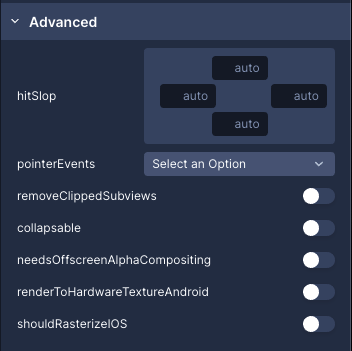

# react-native-jigsaw

Draftbit's specialized component library. Loosely based on React Native Paper, this allows you to incorporate your components into the Draftbit platform. You're also welcome to use this library however you'd like in a typical Expo/React Native project

This is a monorepo containing the packages comprising `@draftbit/ui`,
[Draftbit's](https://draftbit.com) component library used inside our Builder.

See [the `ui` package readme](./packages/ui#readme) for details.

## Quickstart:

```sh
git clone https://github.com/draftbit/react-native-jigsaw && cd react-native-jigsaw
yarn && yarn bootstrap && yarn build
yarn example start -c --web
```

Any changes in the `packages/` typescript files should be automatically picked
up by the Metro bundler and reflected in the example application.

Please read the [contributing guide](CONTRIBUTING.md) before making
a pull-request and to understand the full development flow

## Overview

This is a lerna/monorepo setup that is split up into types, native, core and ui packages.

- packages/ui: pulls in everything from core and native and re-exports it. This is what any user will install to use this Library
- packages/core: Non-native, javascript components go here. These are components that work perfectly across web, ios and android without any adjustments
- packages/native: Native components that rely on expo/react-native modules likes `expo-av` and `@expo/vector-icons`. This houses our AudioPlayer and Icon components because the current version requires modifications to work well on Web
- packages/types: Shared typescript types and SEED_DATA types which is how we build the translation layer for Draftbit

** Chances are, you'll spend most of your time in `packages/core` **

### SEED_DATA

You'll notice that most components will have `SEED_DATA` at the bottom of their files. This is how we incorporate components and props into Draftbit's property panel.

The object at the bottom maps one to one to what the UI will look like in the panel. Here's an example of the "View" component:



Here's an example of what the SEED_DATA prop would look like:

```js
  source: createImageProp(),
  pointerEvents: {
    group: GROUPS.advanced,
    name: "pointerEvents",
    label: "pointerEvents",
    description: "Pointer events"
    options: ["auto", "none", "box-none", "box-only"],
    editable: true,
    required: false,
    formType: FORM_TYPES.flatArray,
    propType: PROP_TYPES.STRING,
    defaultValue: "auto",
  },
```

#### Objects vs. Functions for SEED_DATA

Our legacy implementation included an object, like you see `pointerEvents` above. Moving forward, everything should be a function, like `createImageProp()`. The reason is that its easier to maintain and update across the board when features change inside the builder.

If you're having doubts, use a function. If that function doesn't exist, create it! All the functions live inside [packages/types/src/component-types](https://github.com/draftbit/react-native-jigsaw/blob/master/packages/types/src/component-types.ts)

## Linking

If you want to dynamically link these packages into a project using `yarn link`,
make sure to run `yarn watch <packagename>` from the root folder so that lerna
can properly cross link everything, then `yarn link` from the particular package
directory (not the root!) you are interested in.

So if using `@draftbit/core` in a create-react-app, this would look like:

```console
# In react-native-jigsaw/
$ yarn install
$ yarn watch core

# In ./packages/core/
$ yarn link

# In create-react-app project root
$ <shutdown any running create-react-app dev mode>
$ yarn add @draftbit/core # only if this is the first time using it
$ yarn install
$ yarn link @draftbit/core
$ yarn start
```

You should be able to make changes inside `core/`, have nodemon pick them up and
rebuild, then have create-react-app pick that up and rebuild.

## Publishing

Pre-Release:

- Every pull request will cause a prerelease version to be published on npm.
  You can use these versions to test you changes without having to worry about
  linking packages.

Release Process:

- We release master, meaning a pull-request containing substantive changes
  should not alter any version information.

- When master is ready for release, create a new branch and run a `yarn version:XXXX` command from the root, as appropriate. Lerna will update all
  the package.json files with the next version, and create and tag a commit.

  - **NOTE:** We follow a modified semver: EXPO_VERSION.MAJOR.MINOR.

- Push the branch and tag to github, and open a pull-request for the new
  version.

- When the pull-request is approved and merged to master, a github action
  & lerna will automatically publish all packages to npm with the new version.

- If auto-publication fails, say because npm is down, contributors can also run
  `yarn lerna publish from-package` from an up-to-date master branch. Lerna
  will automatically inspect the registry and the versions on master and
  publish only the appropriate packages.

## Plug

Sound cool? [We're hiring!](https://draftbit.com/jobs).

## License

MIT

## Contributing

- Any color should be passed down via theme prop:

```
// NOT dotColor="#5a45ff" b/c that isn't theme powered
// Learn more here https://callstack.github.io/react-native-paper/theming.html
<Carousel dotColor={theme.colors.strong}>
```
